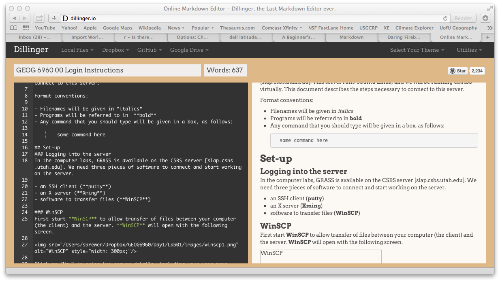

```{r setup, include=FALSE}
knitr::opts_chunk$set(echo = TRUE)
library(png)
library(grid)
```

## Introduction

In this lab, we are going to explore how RStudio can be used to generate reports of your analyses as html files that contain text, code, figures and results. In order to do so, we need to first look at how R can be extended with add-on packages.

Before starting, remember to create a working directory (e.g. `module06`). Next download the files for today's lab from the Canvas page and move them to this directory. You'll need the following file:

- *giss_temp.csv*

Then start RStudio, and change your working directory from the [Session] menu > [Set working directory] > [Choose directory...]. Remember to check that R can see the files by running the `list.files()` command. 

So far, we have been using many of the standard functions that come with the base R installation. This basic functionality can be extended using add-on packages. A package is a collection of pre-programmed functions, that are not found in the base version of R. These are also referred to as libraries, but the R community generally refers to it as a package. A package will usually be designed around a particular type of analysis, and allow R to be used in many different situations. 

There are two types of packages: default packages that come with the base installation of R (i.e. are installed along with R), and packages that must be downloaded and installed. We will cover the installation of new packages later in this lab, but for now just be aware that R comes with tools to manage this installation. 

## Packages and the R workspace

Before we start looking into how to use packages, it is important to understand how these work with R. Packages that are installed are kept in the R library directory, usually buried away in the computer system files. However, even when installed, a package and its functions are not available until it has been *loaded* into the R workspace. Once this is done you can use it's functions, as you would those in the base version.

If you close R, the packages are cleared from the workspace. Upon restarting R, you will need to reload any packages you were using. You do **not** need to reinstall the package, only reload it. 

## Using packages

There are several ways to use a package once it is installed:

- The command `library()` will load a package into the R workspace from the console (or from a script)
- In the basic version of R, using the menu 'Packages > Load package' brings up a window that allows you to load installed packages by double clicking on the name
- In RStudio, the 'Packages' tab in the bottom right panel does the same, bringing up a list of available packages. 

For these last options, clicking in the box next to a package name will load the package, and clicking on the package name will bring up the associated help page.

### An example session using a package

As an example, we are interested in using a classification (or recursive partitioning) tree with the iris dataset. This is a widely used technique in data mining and aims to find the variables that best differentiate between a set of groups. Here, we are interested in understanding which of the morphological variables (petals, sepals) best distinguishes the different species. If we can do this successfully, then we should be able to use the results with a new flower to guess which species that flower came from. 

At this point, we may not know the function that we need to run this analysis, so we can use the search function, here we search for 'tree':

```
??tree
```

This will bring up a list of anything currently installed with the word 'tree' in it's name or description in the help window. If you scroll down the list you will see

> rpart::rpart Recursive Partitioning and Regression Trees

This tells us that there is a function `rpart()`, in the package **rpart** which should do the analysis we are after (the package name is before the `::` and the function name after). The name should be linked to the help page, so clicking on it will bring up a description of the function. If you now try using the function, you will get an error telling you that the function can't be found:

```{r error=TRUE}
rpart()
```

This is because the package is installed (otherwise it wouldn't show in the list), but not loaded. We load the package now using the `library()` function:

```{r}
library(rpart)
```

And now try using the function again:

```{r error=TRUE}
rpart()
```

We still get an error, but now not because the function can't be found, but because we haven't given the function any data to work with. 

Now add the data in to the function. This function uses the relationship operator `~`, and here we state that we are interested in the relationship between the species of iris and the four flower characteristics.

```{r}
rpart(Species ~ Sepal.Length + Sepal.Width + Petal.Length + Petal.Width, 
      data=iris)
```
The output from this function gives information about the classification tree, including the variables that were used to split the groups and some information about how successful these splits were. As with any function, if we want to store the output, we need to assign it to a variable. We can use anything for a variable name, but a simple method is to construct variables as a combination of the data (`iris`) and the function (`rpart`):

```{r}
iris.rpart = rpart(Species ~ Sepal.Length + Sepal.Width + Petal.Length + Petal.Width, 
                   data=iris)
```

The **rpart** package has several functions, including functions for visualizing the classification tree, which will help to understand the output of the model. Type the following to show the tree (without labels):

```{r}
plot(iris.rpart, margin=0.25)
```

The 'margin' option increases the size of the figure margins to allow the labels to fit in. To add labels type:

```{r eval=FALSE}
text(iris.rpart)
```

```{r echo=FALSE}
plot(iris.rpart, margin=0.25)
text(iris.rpart)
```

Now the output makes more sense - the tree is effectively a decision tree. The first split differentiates between the species 'setosa' and the other two. Flowers from 'setosa' have petals shorter than 2.45 cm. The second split then differentiates between 'virginica' and 'versicolor' using the width of the petal, where 'virginica' petals are over 1.75 cm wide. 

If we have the measurements from a petal from an unknown specimen, we should then be able to use this to guess what species it comes from. 

Other functions in the **rpart** package can be found in the help pages. An easy way to see the list for a given package in RStudio is to go to the 'Packages' tab, then click on the name of the package you are interested in. This will bring up the general help page.

```{r fig.width=6.5, fig.height=4., echo=FALSE}
img <- readPNG("images/help1.png")
grid.raster(img)
```

## Installing non-default packages

In addition to the default packages, there are a large number of add-on packages, the vast majority of which will not be installed on your computer. At the time of writing this lab there are 20705 add-on packages available on the main R website [CRAN][cranID], which provide functions for additional graphics, advanced statistical modeling and analysis, parallelization, spatial analysis, bioinformatics, machine learning, data mining and many other topic. To help R users find suitable packages, CRAN maintains a set of [taskviews][cranID], which group packages according to subject area.

Packages can be installed in two ways:

- Use the function `install.packages()` from the console with the name of the package you wish to install
- Go to the 'Packages' menu and select 'Install packages..'
- In RStudio, go to the 'Tools' menu and select 'Install packages..'

Here, we will use the third option. On the CSBS computers, it may ask you if you want to set up a personal library to hold the package information (you probably won't see this if using your own computer). Agree to this, and then the following window should appear (this should only appear the first time you do this):

```{r fig.width=6.5, fig.height=4., echo=FALSE}
img <- readPNG("images/Capture2.PNG")
grid.raster(img)
```

The top line allows you to select the mirror site to download the packages (leave this at its default setting). The text box on the second line is where you add the name of the package. The third line will give the directory on your computer where the packages are to be installed. This should correspond to the 'personal library' created above. Make sure the box labeled "Install dependencies" is ticked. This ensures that any necessary support packages are downloaded and installed with your package. 

We will install a package called **rpart.plot** which can be used to make much nicer plots with the output of the `rpart()` function. Enter the name of this package in the text box, and click 'Install'. You will see some text appear in the console, including a progress bar indicating the download and installation progress. (You may see that all the window is doing is running the `install.packages()` function for you.)

If everything has gone well (and there are no error messages), then the package is installed. Go to the 'Packages' tab, and scroll down, and you should see **rpart.plot** listed there. 

### Using an installed package

Now load this package, either using the `library()` function or from the 'Packages' tab.

```{r}
library(rpart.plot)
```

The main function in this package is `prp()`, which produces better plots of classification trees. Try this now, with the tree that you built with the iris dataset:
```{r eval=TRUE}
prp(iris.rpart)
```

The fonts are better, and it has added labels so that we can understand what the decision is at each split of the tree (left = 'yes', right = 'no'). This function has a huge number of options (see the help page), but two simple ones are `type` and `extra`. An alternative, which puts the variable splits on the branches of the tree, and adds information about how well the splits separate the species is this:

```{r}
prp(iris.rpart, type=3, extra=1)
```

The numbers in each box represent the number of observations of each species that get classified into that group, using the variable splits. This tells us that the first split perfectly differentiates 'setosa', but the second split has some misclassification. For example, the smaller widths correctly classify 49 'versicolor', but also 5 'virginica'. 

```{r echo = FALSE, message=FALSE}
require(knitr)
hook_source_def = knit_hooks$get('source')
knit_hooks$set(source = function(x, options){
  if (!is.null(options$verbatim) && options$verbatim){
    opts = gsub(",\\s*verbatim\\s*=\\s*TRUE\\s*", "", options$params.src)
    bef = sprintf('\n\n    ```{r %s}\n', opts, "\n")
    stringr::str_c(bef, paste(knitr:::indent_block(x, "    "), collapse = '\n'), "\n    ```\n")
  } else {
    hook_source_def(x, options)
  }
})
```


## Report generation

R has several add-on packages that allow you to write reports directly from R, incorporating the code, analyses and plots that you would make. These include **Sweave**, **knitr** and **pander**. These can be used to generate a wide variety of output documents, including LaTeX, RTF, the open document format (ODF) and html. One of the most advanced of these is **knitr**, which integrates extremely well with RStudio. Using **knitr**, reports can be generated in html using *markdown*, a simplified version of the full html markup language. 

The report that you write as part of this course should be generated using **knitr** and markdown, and this lab should provide a sufficient introduction for you to be able to write your own documents. 

## Markdown

We'll start with a quick introduction to markdown, before starting to introduce R code into our document. 

You are probably familiar with html, the markup language that is used to create web pages. Like most markup languages, it works of a series of tags that are used to format different parts of the text. For example, `<h1>` and `</h1>` indicate that the enclosed text is a "level one header", or `<em>` and `</em>` indicate emphasis (generally italics). A web browser will parse the html tags and render the web page, often using a Cascading style sheet (CSS) to define the precise style of the different elements.

Writing directly in html is difficult, as it is necessary to remember all these tags and how they all fit together. Markdown is designed to simplify this, by using very simple formatting. For example, text starting with `#` is a header, text enclosed by `*` is emphasized, and so on. The result is a file that is easy to read even before it is processed into html, and has an easy method for including code: the backtick (on the key to the left of the '1' on your keyboard. See appendix 2 for an example. 

### Markdown syntax

Here is a brief introduction to markdown syntax. Much more detail can be found [here][mdID]

#### Headers

Headers are indicated in markdown using hashmarks `#`. One `#` is a top-level header, two a sub-header and so on up to six sub-headers. The main header can also be defined by adding a line of equal signs on the next line. The two following bits of code will do the same thing:

```
# My header

My header
=========
```

#### Emphasis and bold

Bold text can be written as

```
**This is bold text**
```

Emphasized text uses a single asterix:

```
*This text will be emphasized*
```

#### Lists

markdown can generated unnumbered lists as a set of bullet points (as long as there is a blank line before the list):

```
- List item 1
- List item 2
- List item 3
```

Or as numbered lists:

```
1. List item 1
2. List item 2
3. List item 3
```

#### Links

Links to web pages can be included. Usually this is done in two ways. The word that will have the hyperlink is enclosed in `[,]`, and followed by a reference. Elsewhere in the document (usually at the end) the reference is connected to the full URL. For example:

```
I get 10 times more traffic from [Google][1] than from [Yahoo][2] or [MSN][3].

[1]: http://google.com/        "Google"
[2]: http://search.yahoo.com/  "Yahoo Search"
[3]: http://search.msn.com/    "MSN Search"
```

will convert the words "Google", "Yahoo" and "MSN" in the first line into hyperlinks. 

#### Horizontal lines
A horizontal line can be specified by a line of hyphens:

```
-----
```

#### Code

The ease in which programming code can be formatted in a document has made markdown a favorite tool for writing documents and tutorials on programming. For example, all of the lab documents for this course are written using markdown. Text that should be formatted as code is usually shown enclosed in backticks or by indenting the code by four spaces (one tab stop).

```
    ```
    Some code
    ```
```    
Or

```
    Some code
```

### Processing markdown

Once the markdown file is written, it can be processed into html. There are quite a few processors that can be used, but a couple of good online free processors and editors are [stackedit][seID] and [dillinger][dlID].



Dillinger interface showing the markdown editor on the left and the processed html on the right. 

### R Markdown

[R Markdown][rmID] is a variant of Markdown developed by the same people who developed RStudio. It allows you to embed *chunks* of R code which is then used with the **knitr** package to create reproducible web-based reports. The clever part about **knitr** is that it will take this code, and actually run it in R. So any R code you include will be processed, and the results can be displayed. This has several advantages: 1) it makes sure that the results are exactly those produced by R (and that the code is consistent with the results); 2) it allows you to easily update your report using new or extra data; 3) the figures are produced directly in the report; 4) your reports are easy to publish on the web. 

## knitr

[knitr][knID] is a package developed by Yihui Xie to embed R code into different documents. This needs to be installed on your computer before you can start generating reports. Use the instructions from the previous lab to install this package. 

### A first R Markdown document

Go to the [File] menu > [New File] > [R Markdown...]. A window will open, prompting you for a title of your report, plus the format you want the final document in. Select 'HTML' for now. A new markdown document will open in the top-left panel. This is a template and already has some markdown code in it, including the following header which specifies the title, author, date and output format:

```
---
title: "Untitled"
author: "Simon Brewer"
date: "April 30, 2020"
output: html_document
---
```

Delete everything apart from this header section (you can change the title etc if needed). Now we'll add some text to the document. Type the following code into the document:

```
## My first report
A first example of generating a report using R, RStudio and **knitr**. 
The goal of this report is to:

- Generate a simple report
- Include some R code
- Include a figure generated by R
```

Save the file into your current working directory (it will save with the extension `*.Rmd`). Now we need to process this with **knitr**. On the top menu of the editor panel, you should see a button [Knit]. 

```{r fig.width=1.5, fig.height=0.5, echo=FALSE}
img <- readPNG("images/button.png")
grid.raster(img)
```

Click this button, and **knitr** will process the file. Once done, RStudio will open a preview window showing your markdown code converted to html:

```{r fig.width=6.5, fig.height=4., echo=FALSE}
img <- readPNG("images/htmlout2.png")
grid.raster(img)
```

If you look in your working directory, you should see a new html file with the same name as the R Markdown file. This second file can be open directly in a browser, or sent to colleagues to share your analysis. 

If you click on the down arrow next to the [Knit] button, you will see some other options, including 'knitting' to a Word document or PDF. If you select 'Word' this will create a Word document using Microsoft's XML format. Generating PDFs require a LaTeX application to be available on your computer, but can be used to produce some very nice looking documents.

We'll now add some R code into this document. Each block of code is called a 'chunk' and is preceded by three backticks and the string `{r}`. The chunk is ended by another three backticks. So a very simple example to add two numbers would be:

````markdown
`r ''````{r}
5 + 6
```
````

```
    ```{r}
    5 + 6
    ```
```

Add this to your markdown file, and click on the 'Knit HTML' button. Check the html preview window, and you should see the following lines added to your output:

```{r}
5 + 6
```
The html output therefore has, not only the R code that you entered, but the result of that code. 

We'll now add more code to this example to read in some data and calculate summary statistics. Add the following code to read in the GISS global temperature data set *giss_temp.csv*, and calculate some summary statistics. 

```{r}`r ''`
giss = read.csv("giss_temp.csv")
summary(giss)
```
Add some text before and after the code to explain what is going on. Remember that you can  add sub-headers with two hashmarks `##`. Other formatting tips can be found by clicking on the button with a question mark, and selecting 'Markdown Quick Reference'. 

Now add code to calculate the mean temperature deviation per year, and make a vector of years:

```{r}`r ''`
annualTemp = tapply(giss$TempAnom, giss$Year, mean)
years = unique(giss$Year)
```
Again, add some text with outside of the backticks to explain what is going on. Click 'Knit HTML' to check the output. 

Finally, we'll add a couple of plots to the output. Before doing this, we'll add a subheader to the file and a short amount of text

## Plot section
First, a histogram showing the distribution of all temperature anomaly values. 
Second, a plot of annual temperature change.

Now start by plotting a histogram of all the temperature values:

```{r}`r ''`
hist(giss$TempAnom, breaks=20)
```
And a line plot showing the annual temperatures

```{r}`r ''`
plot(years, annualTemp, type='l', lwd=2, col=2, 
xlab="Years", ylab="Temp Anom")
abline(h=0, lty=2)
```
Add some text to explain what the code is doing, and click 'Knit HTML' to get the final report. When it is finished, go to your working directory, and double click the *.html file to open this in a browser. 

### Chunk options

**knitr** has a set of [options][opID] for modifying the way in which the chunks are run. This is done by adding options in between brackets at the start of the chunk (`{r}`). For example, `{r echo=FALSE}` will run the code, but not display it in the document. Some other options are:

- `fig.keep=FALSE`: doesn't display any figures
- `fig.width=10`: alters the figure width (size in inches)
- `fig.height=7`: alters the figure height (size in inches)
- `results='hide'`: doesn't display any output from R
- `eval=FALSE`: don't run the R code
- `cache=TRUE`: only run the R code once and save the output for subsequent 'knits'. This is very useful for code that takes a long time to run

Multiple options can be used by separating them by commas, e.g. `{r fig.width=10,fig.height=7}` will make a 10x7 figure in the output. 

## Publishing your markdown documents

If you use **knitr** to compile your document to an html page, this can be placed on any web server to help share your code and analyses. The website [RPubs.com][rpID] is designed to integrate with RStudio to make this process easy. When you have compiled your html document, you should see a small button in the top right hand corner 'Publish':

```{r fig.width=1.5, fig.height=.5, echo=FALSE}
img <- readPNG("images/publish.png")
grid.raster(img)
```

If you click on this, RStudio will upload your document to RPubs. R will likely prompt you to install some add-on packages and you will need to create an account. Note that this is a public website, and your code and results will be visible to anyone.

## Exercise

- Choose any one of the previous exercises from this class. Create a new R markdown file with the code you used in this exercise, and some text to describe what the code is doing. Use **knitr** to convert this to html. 
- Set up an account on RPubs.com and publish your html page there

You can either submit the html page through Canvas, or a link to the page on your RPubs account

## Files used in lab

### *giss_temp.csv*

GISS northern hemisphere temperature dataset

| Column header | Variable |
| --- | --- |
| Year | Year |
| Month | Month |
| DecDate | Decimal data |
| TempAnom | Temperature anomaly |
|  | Deviation from long-term mean ('61-'90) |

[kbID]: http://kbroman.github.io
[mdID]: https://daringfireball.net/projects/markdown/syntax
[seID]: https://stackedit.io
[dlID]: http://dillinger.io
[rmID]: http://rmarkdown.rstudio.com
[knID]: http://yihui.name/knitr/
[opID]: http://yihui.name/knitr/options/
[rpID]: http://rpubs.com
